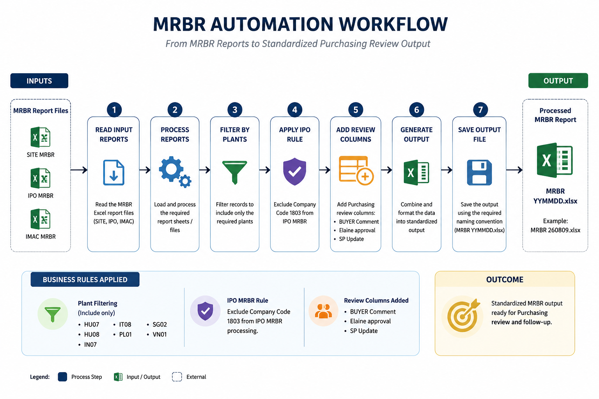
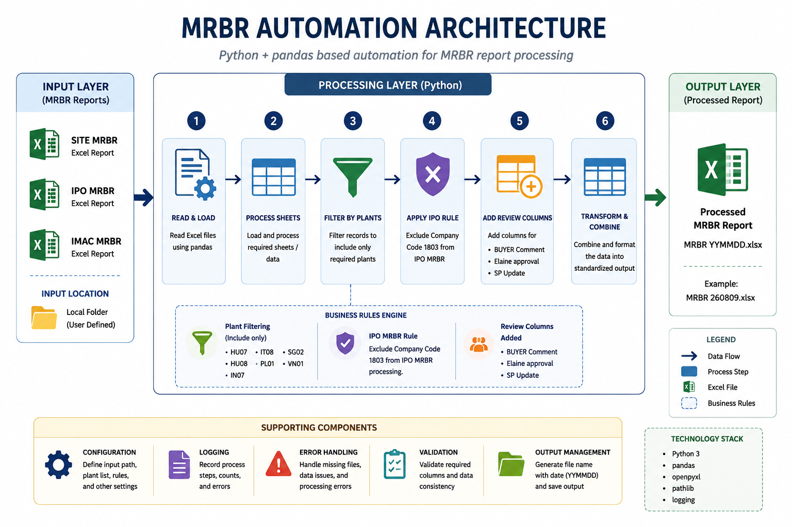

# MRBR Report Automation

**Status: Production**

Python automation that processes MRBR Excel reports and prepares standardized workbooks for the Purchasing team.

## Overview

MRBR report preparation previously required manual processing of multiple Excel worksheets, including plant filtering, business-rule filtering, and preparation of Purchasing follow-up fields.

This automation performs those steps programmatically and generates a standardized output workbook for Purchasing review.

## Business Problem

Manual MRBR preparation is repetitive and depends on consistent application of Purchasing rules across multiple report sheets.

The automation standardizes this preparation process and reduces repetitive manual handling.

## Solution

The Python script:

* Reads the `SITE MRBR`, `IPO MRBR`, and `IMAC MRBR` worksheets.
* Filters records to the required Purchasing plants.
* Applies the IPO Company Code filtering rule.
* Adds predefined Purchasing follow-up fields.
* Generates a standardized Excel workbook.
* Saves the processed workbook to the designated IMAC server location.

## Workflow

`MRBR Export → Server Input → Python Processing → Filtering & Transformation → Processed MRBR → Server Output`

## Architecture

The automation uses Python and pandas for Excel data processing. SAP is outside the direct automation boundary; the process begins after the MRBR report has been exported.

## Technologies

* Python
* pandas
* Microsoft Excel
* openpyxl

## Key Features

* Multi-sheet Excel processing
* Plant-based filtering
* IPO Company Code filtering
* Automated Purchasing review fields
* Standardized workbook generation
* Server-based input and output workflow

## Input & Output

**Input:**
MRBR Excel report exported to the designated server location.

**Output:**
Processed MRBR workbook saved to the designated IMAC server output location.

## My Role

I designed and developed the automation based on the Purchasing workflow. My work included defining the processing logic and business rules, developing the Python solution, testing the generated output, and maintaining the production automation.

## Limitations

* The automation depends on the expected MRBR worksheet and column structure.
* Plant and business-rule values are currently defined in the Python implementation.
* The automation does not directly execute SAP transactions or control SAP GUI.

## Future Improvements

Potential improvements include:

* Externalizing business rules and configuration
* Stronger input validation
* Structured logging
* Automated testing

## Disclaimer

This repository is a portfolio representation of a production business automation. Company-specific data, credentials, and confidential information are excluded. Sample data is provided for demonstration purposes.
